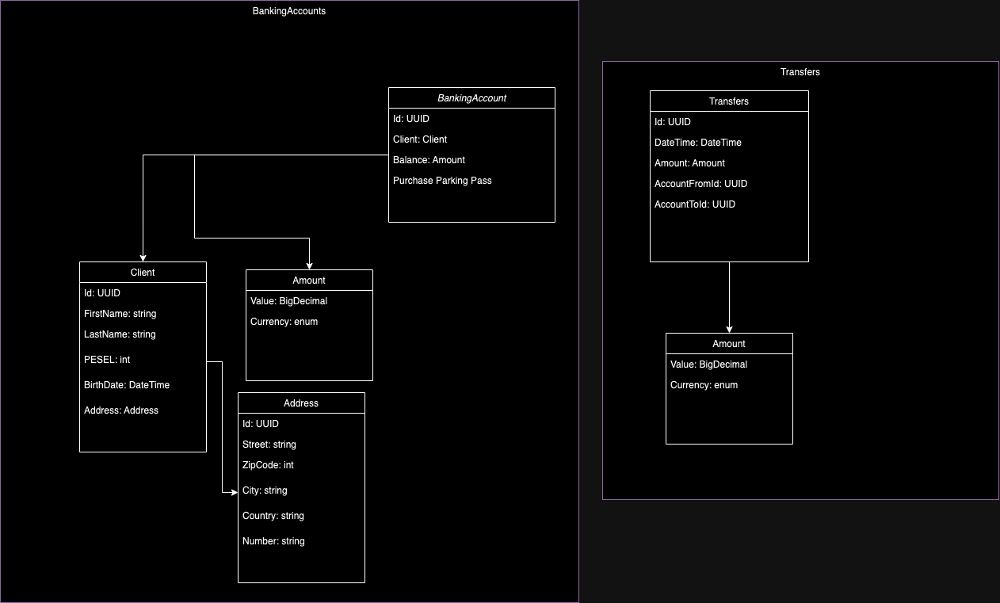

# Zadanie 1

## Domain Driven Design

W projekcie zdefiniowano 2 konteksty:
- BankingAccounts
- Transfers

Kontekst - BankingAccounts:
- BankingAccounts - Aggregate
- Client - Entity
- Address - Entity
- Amount - ValueObject

Kontekst - Transfers:
- Transfers - Aggregate
- Amount - ValueObject

Poniżej przedstawiam założenia formatu danych trzymanych jako tekst. Pozostałe dane powinny być trzymane w formacie zgodnym z typami jako które występują.
Założenia formatu danych w stringach:
- Client:
  - FirstName - znaki alfabetyczne
  - LastName - znaki alfabetyczne
- Address:
  - Street - znaki alfanumeryczne
  - City - znaki alfanumeryczne
  - Country - znaki alfanumeryczne
  - Number - znaki alfanumeryczne